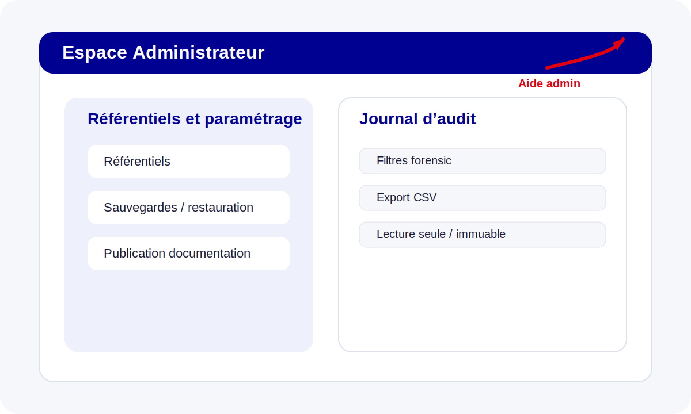

# Guide Administrateur

Le profil **Administrateur** supervise le paramétrage, les référentiels, le journal d’audit et l’exploitation de la plateforme.

## Référentiels, paramétrage et sauvegarde

L’administrateur intervient sur :
- les référentiels ;
- les habilitations ;
- la supervision des sauvegardes / restaurations ;
- la validation des workflows transverses.

## Supervision et audit

Le module **Journal d’audit** permet :
- de filtrer les événements critiques ;
- d’exporter le journal pour analyse ;
- de confirmer le caractère lecture seule et immuable des traces.

## Documentation et exploitation

Ce profil est aussi responsable :
- de la disponibilité de la documentation en ligne ;
- de la génération PDF ;
- de la publication du site de documentation sur la branche principale.
