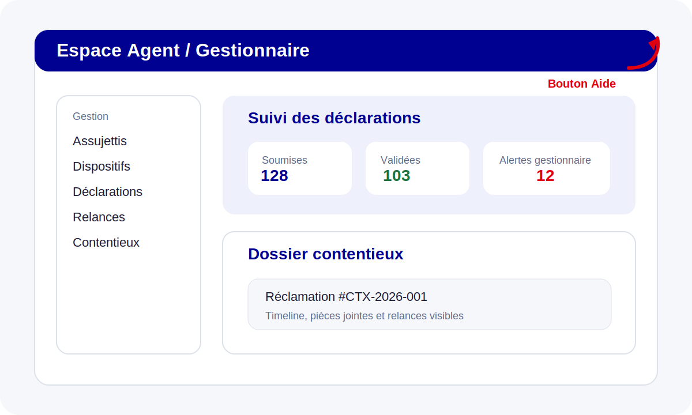

# Guide Agents

Le profil **Agent / Gestionnaire** couvre la gestion des assujettis, des dispositifs, des déclarations, des relances et des contentieux courants.

## Gestion des assujettis et dispositifs

Depuis le menu latéral :
- **Assujettis** : créez, mettez à jour et recherchez les redevables ;
- **Dispositifs** : visualisez les supports publicitaires, enseignes et préenseignes associés ;
- **Carte des dispositifs** : vérifiez le positionnement et la zone tarifaire.

## Déclarations et campagnes

Les agents peuvent :
- suivre les campagnes ouvertes ;
- contrôler les déclarations soumises ;
- consulter les alertes de complétude, doublons et écarts N/N-1 ;
- accéder au suivi des relances et aux mises en demeure.

## Contentieux et pièces jointes

Le module **Contentieux** permet :
- de consulter le dossier et sa timeline ;
- d’accéder aux pièces jointes et aux métadonnées de restitution ;
- d’orienter le dossier vers les équipes financières ou administratives si nécessaire.

## Lien d’aide contextualisé

Le bouton `Aide` de l’en-tête redirige automatiquement vers la section la plus pertinente de cette documentation selon la page en cours.
