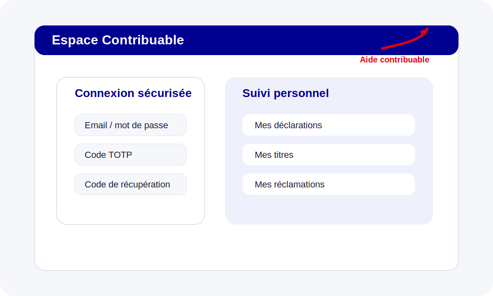

# Guide Contribuable

Le profil **Contribuable** dispose d’un portail restreint à ses propres déclarations, titres, contentieux et paramètres de compte.

## Connexion sécurisée et double authentification

Le parcours de connexion couvre :
- l’identification par email + mot de passe ;
- la vérification **2FA TOTP** si activée ;
- l’usage de codes de récupération ;
- la gestion du compte dans **Paramètres du compte**.

## Simulation, déclaration et suivi

Le contribuable peut :
- utiliser le **simulateur** ;
- consulter ses déclarations ;
- suivre ses titres ;
- consulter ses réclamations contentieuses.

## Aide depuis l’application

Le bouton `Aide` renvoie automatiquement ici depuis `/login`, `/simulateur`, `/declarations`, `/titres`, `/contentieux` et `/compte`.
