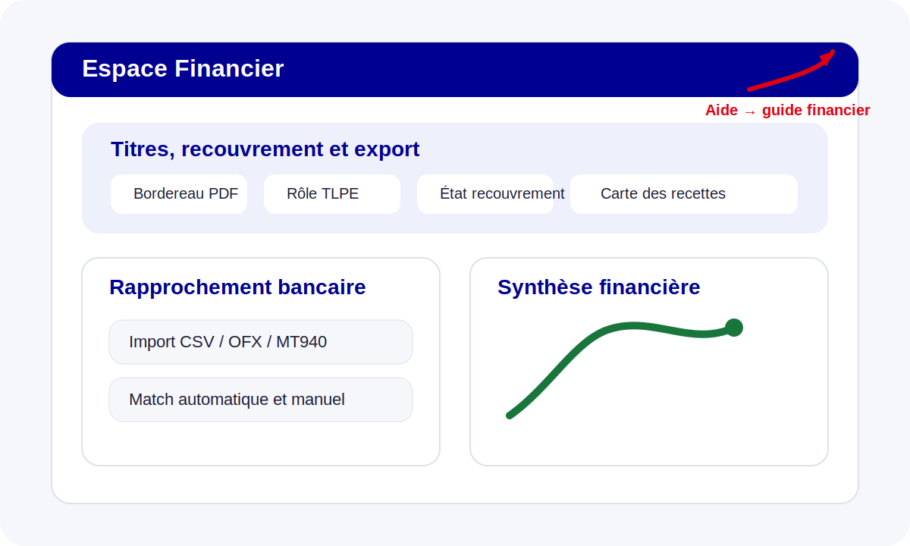

# Guide Financier

Le profil **Financier** est centré sur les titres, le recouvrement, les exports et le rapprochement bancaire.

## Titres, recouvrement et export

Les fonctionnalités principales :
- consultation des titres de recettes ;
- génération des bordereaux, rôles TLPE et états de recouvrement ;
- exports PDF / Excel horodatés ;
- pilotage du comparatif pluriannuel et des cartes de recettes.

## Rapprochement bancaire

La page **Rapprochement bancaire** permet :
- d’importer des relevés `csv`, `ofx` ou `mt940` ;
- de lancer les rapprochements automatiques ;
- de traiter les cas manuels ou les exceptions.

## Suivi financier des contentieux

Le financier visualise également :
- le montant en litige ;
- les synthèses exportables ;
- les alertes associées aux dossiers sensibles.

## Aide contextuelle

Le lien `Aide` pointe depuis `/titres`, `/recouvrement`, `/rapprochement` et les écrans d’export vers cette page et ses ancres dédiées.
