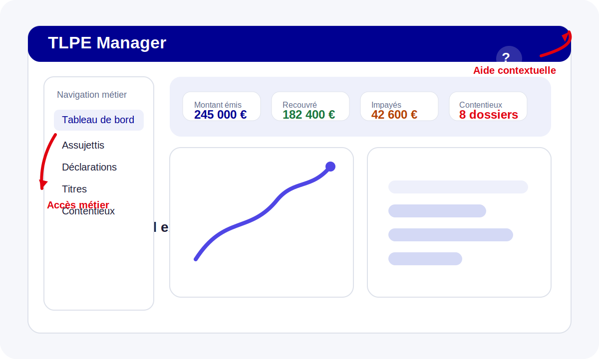

# Documentation utilisateur TLPE Manager

Bienvenue dans la documentation utilisateur du **TLPE Manager**. Ce site regroupe les parcours métier essentiels pour exploiter l’application sans formation préalable, avec un point d’entrée par profil utilisateur.

## Ce que vous trouverez ici

- un **guide d’installation** pour démarrer l’application localement ;
- des **guides par rôle** pour les agents métier, les financiers, les contrôleurs terrain, les contribuables et les administrateurs ;
- des **liens d’aide contextualisés** directement dans l’interface grâce au bouton `Aide` présent dans l’en-tête de l’application ;
- une **exportation PDF** produite à partir des mêmes sources Markdown via MkDocs.

## Parcours recommandés

- **Agent instructeur / gestionnaire** : commencez par le guide [Agents](agents.md).
- **Équipe finances / recouvrement** : rendez-vous dans [Financier](financier.md).
- **Contrôle terrain** : consultez [Contrôleur](controleur.md).
- **Contribuable** : suivez [Contribuable](contribuable.md).
- **Paramétrage et supervision** : ouvrez [Administrateur](administrateur.md).

## Déploiement documentation

La publication est prévue sur **GitHub Pages** via le site MkDocs généré à partir du dossier `docs/`.
