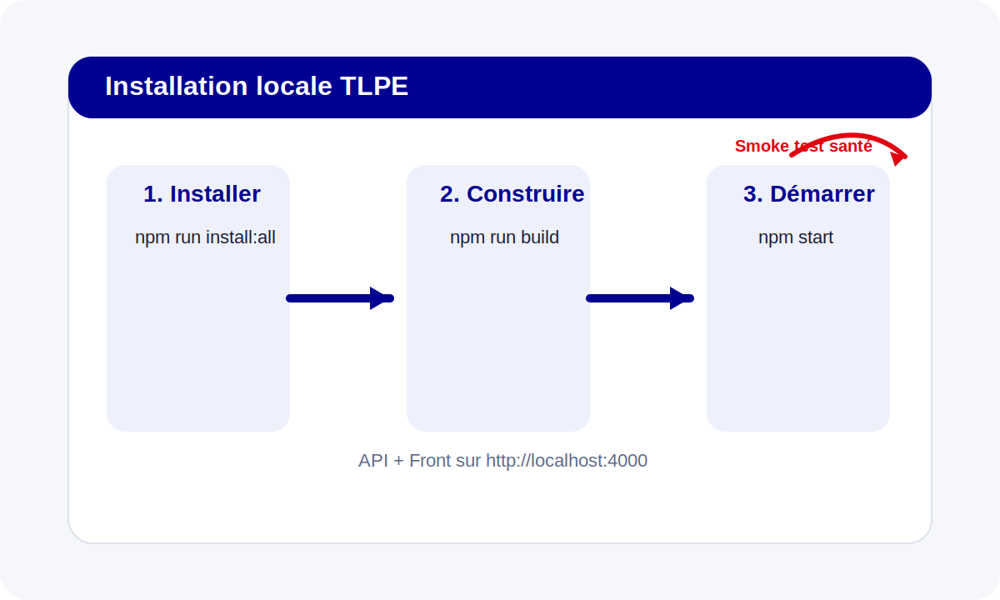

# Installation

Cette page décrit l’installation locale de TLPE Manager pour une commune, une équipe projet ou un environnement de démonstration.



## Prérequis

- Node.js 20+
- npm 10+
- Linux/macOS/WSL recommandé
- `xmllint` pour certains tests XSD backend

## Installation rapide

```bash
npm run install:all
npm run build
npm start
```

Ensuite :
- backend + frontend servis sur `http://localhost:4000`
- healthcheck : `http://localhost:4000/api/health`

## Mode développement

```bash
npm run dev
```

- API Express : port `4000`
- Front Vite : port `5173`

## Comptes de démonstration

Le seed initial crée notamment :
- `admin@tlpe.local / admin123`
- `gestionnaire@tlpe.local / gestion123`
- `financier@tlpe.local / finance123`
- `controleur@tlpe.local / controle123`
- `contribuable@tlpe.local / contrib123`

## Documentation PDF

Le site MkDocs permet de produire une version PDF depuis les mêmes sources Markdown que la documentation en ligne.
