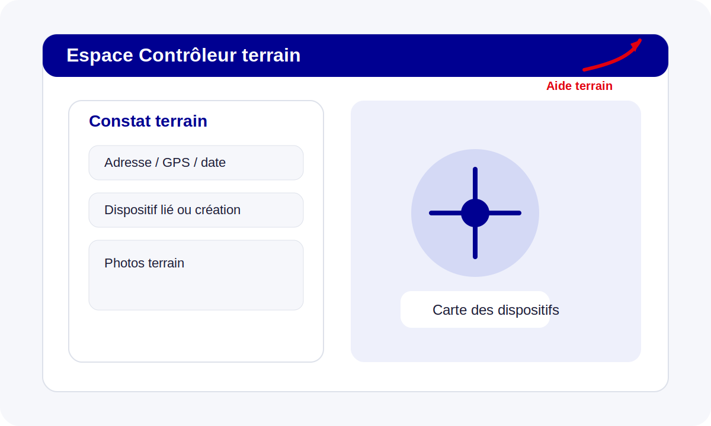

# Feuille de route mobile native (US7.2)

Cette page cadre l'**US7.2 — Application mobile iOS / Android de contrôle terrain**.

> Statut actuel : **issue ouverte / bloquée par dépendances externes et hors périmètre MVP**.

Le dépôt TLPE Manager livre déjà le contrôle terrain **web responsive** avec géolocalisation navigateur, prise de photos, rattachement à un dispositif existant ou création de fiche et brouillons hors-ligne navigateur. La présente feuille de route décrit ce qu'il reste à fournir pour une **vraie application mobile native ou cross-platform**.

## Pourquoi l'US reste ouverte

Les critères d'acceptation de l'issue #31 demandent notamment :

- une application **iOS / Android** ;
- une authentification JWT partagée avec le backend ;
- une carte locale des dispositifs ;
- une saisie de constat **hors connexion** avec photos stockées localement ;
- une synchronisation différée ;
- des **notifications push** pour les missions ;
- une **publication sur stores**.

Ces éléments dépassent le périmètre du MVP web actuel et nécessitent des prérequis non présents dans ce dépôt : comptes développeur Apple / Google, chaîne de build mobile, stratégie de distribution MDM/store, services push et gouvernance terminale.

## Pré-requis à lever avant développement

### Gouvernance et exploitation

- compte **Apple Developer Program** au nom de la collectivité ;
- compte **Google Play Console** au nom de la collectivité ;
- décision de distribution : stores publics, diffusion privée, ou MDM ;
- politique de gestion des terminaux (perte, renouvellement, révocation, chiffrement local) ;
- politique de conservation locale des photos et constats hors-ligne.

### Technique

- choix de stack confirmé : **React Native** ou **Flutter** ;
- stratégie cartographique mobile (ex. **MapLibre**) ;
- service de notifications push (APNs / FCM) ;
- convention de versionnement et de signature applicative ;
- pipeline CI/CD mobile séparée du monorepo web.

## Architecture cible recommandée

### 1. Authentification

- réutiliser le backend TLPE existant et ses JWT ;
- ajouter si nécessaire un flux de rafraîchissement de jeton adapté à une session mobile longue ;
- stocker les secrets de session dans le coffre natif du terminal (Keychain / Keystore), jamais dans un stockage non chiffré.

### 2. Données locales

- base locale chiffrée pour les missions, dispositifs synchronisés, constats brouillons et file d'upload ;
- table locale de correspondance entre identifiants temporaires offline et identifiants serveur ;
- purge pilotée des photos et brouillons déjà synchronisés.

### 3. Synchronisation différée

- file transactionnelle locale : `create-constat`, `upload-photo`, `close-constat` ;
- replay idempotent côté serveur pour éviter les doublons ;
- stratégie de reprise après échec partiel (constat créé mais photo non envoyée, par exemple) ;
- journal de synchronisation visible par le contrôleur.

### 4. Cartographie

- téléchargement local d'un extrait des dispositifs affectés au contrôleur et des zones utiles ;
- cache différentiel pour éviter un rechargement complet à chaque session ;
- fond cartographique compatible usage hors-ligne si le besoin est confirmé.

### 5. Notifications push

- modèle de mission affectée côté backend ;
- enregistrement d'un token push par terminal ;
- gestion d'opt-in/opt-out et révocation d'un terminal perdu ;
- fallback email/web si le push n'est pas disponible.

## Contrat minimum à stabiliser côté backend

Avant une implémentation mobile, l'API backend doit explicitement garantir :

- un endpoint de santé : `/api/health` ;
- un login JWT stable et documenté ;
- des endpoints de consultation des dispositifs filtrés pour le contrôle terrain ;
- une création de constat idempotente ou au moins dédoublonnable ;
- un upload photo compatible reprise ;
- une traçabilité `audit_log` des synchronisations mobiles.

## Jalons proposés

1. **Cadrage produit & sécurité**
   - valider la distribution, les comptes stores et la politique terminale.
2. **Spike technique mobile**
   - démontrer login JWT, carte MapLibre, persistance locale et upload photo.
3. **Contrat API mobile**
   - figer payloads, erreurs métier, stratégie d'idempotence et tokens push.
4. **MVP mobile interne**
   - test sur flotte restreinte, sans publication store ouverte.
5. **Publication / déploiement**
   - conformité stores, monitoring, support et procédures de révocation.

## Définition de terminé réaliste pour l'US7.2

L'US ne pourra être fermée que lorsque les éléments suivants seront simultanément disponibles :

- binaire iOS et Android distribué aux agents ;
- authentification JWT réellement opérationnelle sur mobile ;
- consultation cartographique et saisie de constat hors-ligne ;
- synchronisation différée testée en reprise réseau ;
- notifications push raccordées aux missions ;
- documentation d'exploitation mobile et procédure de support terminal ;
- validation métier + sécurité + publication effective.

## Smoke tests attendus pour une future livraison

- démarrage de l'application sans erreur sur iOS et Android ;
- login avec un compte contrôleur ;
- téléchargement local d'un jeu de dispositifs ;
- création d'un constat et prise de photo en mode avion ;
- retour en ligne puis synchronisation complète sans doublon ;
- réception d'une notification push de mission sur un terminal enrôlé.

## Références croisées

- `README.md` → section **Hors périmètre du MVP**
- `CLAUDE.md` → rappel explicite que l'app mobile terrain n'est pas à proposer par défaut
- `docs/controleur.md` → parcours web actuel des contrôleurs
- issue GitHub : [#31 — US7.2 Application mobile iOS / Android](https://github.com/KikiFUNstyle/TLPE/issues/31)